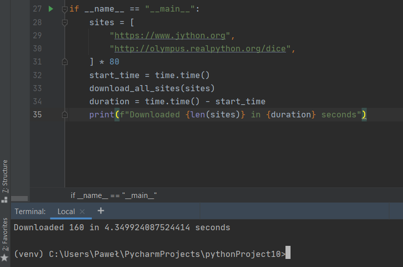
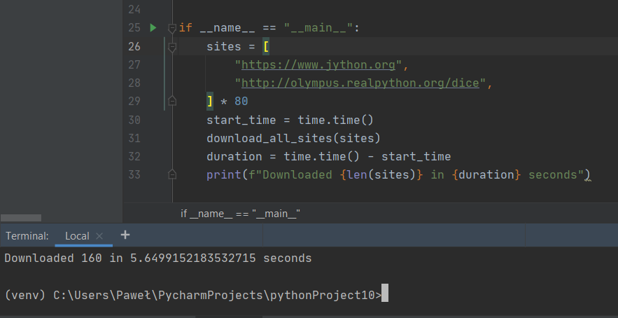
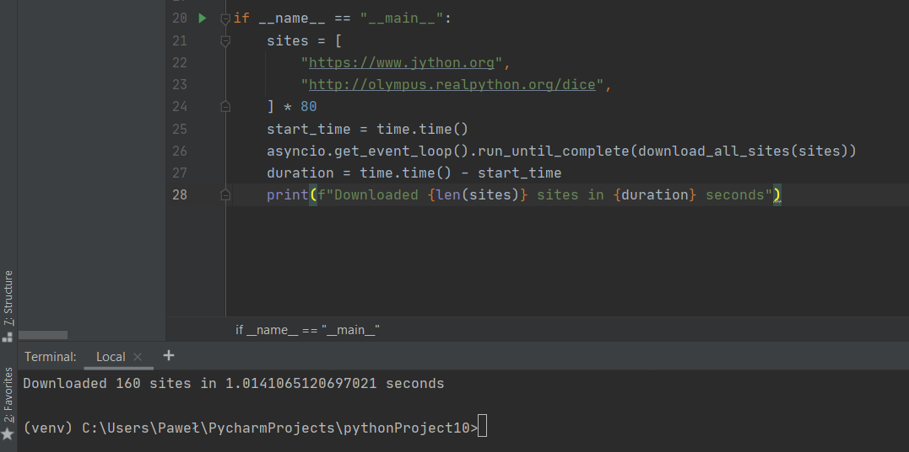
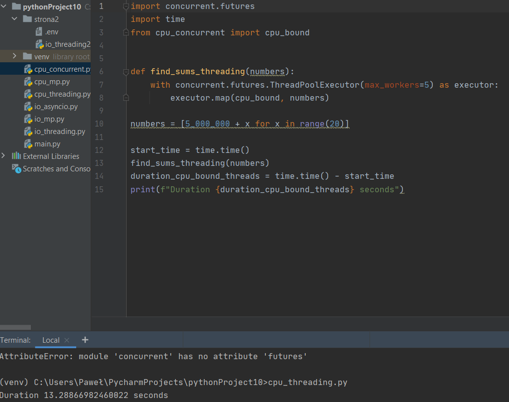
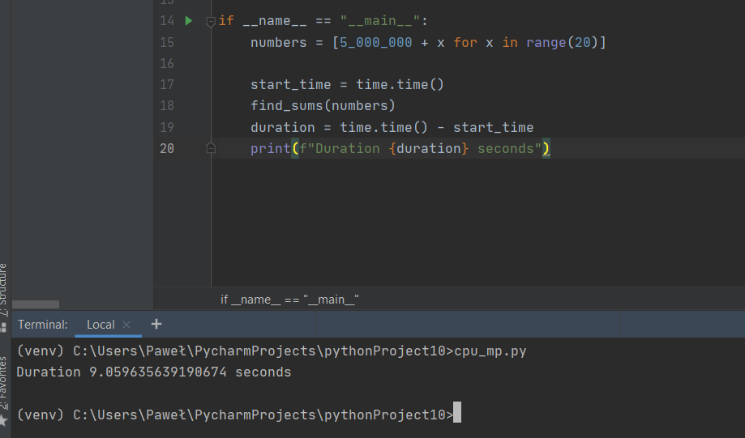
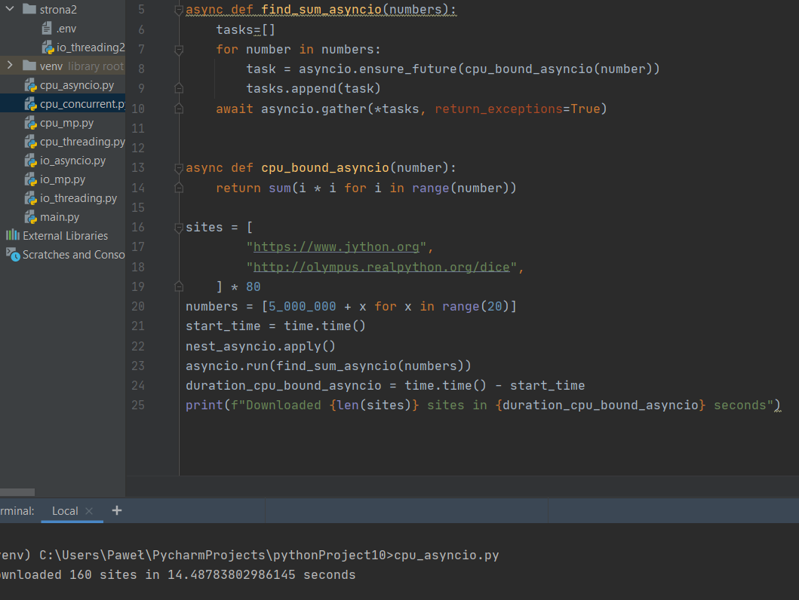
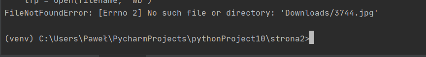

# Współbieżność w Pythonie
## Navigation List:
### Strona 1 - Współbieżność w Pythonie(RealPython)
I/O
* [Threading](https://github.com/PawelM98/Uczenie_Maszynowe/tree/master/Lab10#strona-1---io) 
* [Multiprocessing](https://github.com/PawelM98/Uczenie_Maszynowe/tree/master/Lab10#multiprocessing) 
* [Asyncio](https://github.com/PawelM98/Uczenie_Maszynowe/tree/master/Lab10#asyncio) 

CPU
* [Threading](https://github.com/PawelM98/Uczenie_Maszynowe/tree/master/Lab10#strona-1---cpu) 
* [Multiprocessing](https://github.com/PawelM98/Uczenie_Maszynowe/tree/master/Lab10#multiprocessing-1) 
* [Asyncio](https://github.com/PawelM98/Uczenie_Maszynowe/tree/master/Lab10#asyncio-1) 
### Strona 2 - Optymalizacja dzięki współbieżności
* [Threading](https://github.com/PawelM98/Uczenie_Maszynowe/tree/master/Lab10#threading-2) 
* [Multiprocessing](https://github.com/PawelM98/Uczenie_Maszynowe/tree/master/Lab10#multiprocessing-2) 
* [Asyncio](https://github.com/PawelM98/Uczenie_Maszynowe/tree/master/Lab10#asyncio-2) 

# Poniżej Wyniki działań:
## Strona 1 - I/O
### Threading 
Struktura kodu źródłowego pozostaje taka sama jak w przypadku wersji synchronicznej z wyjątkiem małej zmiany w metodzie download_all_sites oraz dodanie metody get_session. 
ThreadPoolExecutor tworzy pulę wątków i w tym przypadku ogranicza liczbę wątków do 5. 
Metoda executor.map() automatycznie dzieli pracę na wątki. 
 
Czas Threading: 4,34992408752441 seconds 
[NaviList](https://github.com/PawelM98/Uczenie_Maszynowe/tree/master/Lab10#navigation-list) 

### Multiprocessing 
Wersja z użyciem wielu procesorów 
Multiprocessing jest trochę wolniejszy od wersji threading oraz asyncio. Te lekkie opóźnienie spowodowane jest przez tworzenie oddzielnego interpretera dla każdego procesu. 
 
Czas Threading: 4,34992408752441 seconds  
Czas Multiprocessing: 5,6499152183532715 seconds 
[NaviList](https://github.com/PawelM98/Uczenie_Maszynowe/tree/master/Lab10#navigation-list) 

### Asyncio
W wersji Asyncio pojedynczy obiekt Pythona decyduje o kontroli jak i kiedy zadanie zostanie uruchomione. Ważnum czynnikiem jest tutaj stan każdego zadania. 
 
Czas Threading: 4,34992408752441 seconds 
Czas Multiprocessing: 5,6499152183532715 seconds 
Czas Asyncio: 1,014065120697021 
[NaviList](https://github.com/PawelM98/Uczenie_Maszynowe/tree/master/Lab10#navigation-list) 

## Strona 1 - CPU
### Threading 
Wersja ta jest nie opłacalna względem wersji synchronicznej 
 
Czas Threading: 13,28866982460022 seconds 
[NaviList](https://github.com/PawelM98/Uczenie_Maszynowe/tree/master/Lab10#navigation-list) 

### Multiprocessing 
W tym przypadku wersja działająca na wielu procesorach wygrywa z pozostałymi 
 
Czas Threading: 13,28866982460022 seconds 
Czas Multiprocessing: 9,059635639190674 seconds 
[NaviList](https://github.com/PawelM98/Uczenie_Maszynowe/tree/master/Lab10#navigation-list) 

### Asyncio
Podobnie jak threading nie jest opłacalna 
 
Czas Threading: 13,28866982460022 seconds 
Czas Multiprocessing: 9,059635639190674 seconds 
Czas Asyncio: 14,48783802986145 
[NaviList](https://github.com/PawelM98/Uczenie_Maszynowe/tree/master/Lab10#navigation-list) 

## Strona 2 - Stackabuse
 
### Threading
Tekst 
 
[NaviList](https://github.com/PawelM98/Uczenie_Maszynowe/tree/master/Lab10#navigation-list) 

### Multiprocessing
Tekst 
 
[NaviList](https://github.com/PawelM98/Uczenie_Maszynowe/tree/master/Lab10#navigation-list) 

### Asyncio
Tekst 
 
[NaviList](https://github.com/PawelM98/Uczenie_Maszynowe/tree/master/Lab10#navigation-list) 