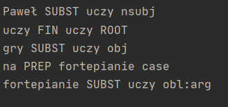

# Praca z tekstem - spaCy
### Wszystkie teksty użyte podczas Laboratorium: 

1. introduction_text = ('To jest tutorial o przetwarzaniu naturalnych języków w Spacy.')
2. about_text = ('Paweł Michciński jest studentem Informatyki na Akademi '
              'Marynarki Wojennej od Października 2017 roku.'
              ' Jest on zainteresowany przetwarzaniem języka naturalnego - NLP.')
3. ellipsis_text = ('Robert, czy możesz, ... nie ważne, Zapomniałem'
                 ' co chciałem powiedzieć. Więc, myślisz'
                 ' że powinniśmy ...')              
4. conference_help_text = ('Paweł pomaga w zorganizowaniu'
                         ' konferencji o aplikacjach przetwarzania języków'
                         ' naturalnych. Stale organizuje lokalne spotkania Pythonowe'
                         ' oraz kilka spotkań organizacyjnych w jego miejscu pracy.')
5. complete_text = ('Paweł Michciński jest Python developerem '
                 'pracującym dla firmy Finetech z lokalizacją w Londynie. Jest'
                 ' zainteresowany nauką przetwarzania naturalnych języków NLP.'
                 ' 21 Lipca 2019 w Londynie odbywa się'
                 ' developerska konferencja. Jest zatytuowana "Aplikacje przetwarzania'
                 ' języków naturalnych NLP". Linia pomocnicza znajduje się'
                 ' pod numerem +48-123456789. Paweł pomaga w organizacji.'
                 ' Paweł jest specjalistą od organizacji, od kiedy jest w tej firmie')              
6. conference_org_text = ('Istniejąca developerska konferencja'
                        'mająca miejsce 21 Lipca 2019 w Londynie. Nosi tytuł'
                        ' " języka naturalnego".'
                        ' Numer pomocniczy jest następujący:'
                        ' (123) 456-789')                     
7. piano_text = 'Paweł uczy gry na fortepianie'
8. one_line_about_text = 'Paweł Michciński jest Python developerem pracującym dla firmy Finetech z lokalizacją w Londynie'
9. conference_text = ('Konferencja developerska jest '
                    ' 21 Lipca 2019 roku w mieście Londyn.')
10. about_talk_text = ('Przedstawienie będzie mówiło uczestnikowi o'
                    ' zagadnieniach przetwarzania naturalnych języków NLP'
                    ' w firmie Fintech')
11. piano_class_text = ('Akademia Piano jest usytuowana'
                     ' w Lublinie lub w mieście Warszawa i ma'
                     ' światowej klasy instruktorów pianina.')
12. survey_text = ('Spośród 5 ankietowanych osób, Paweł Michciński,'
               ' Jan Kowalski i Andrzej Nowak lubią'
               ' jabłka. Anna Nowak i Mariola Kowalska'
               ' lubią pomarańcze.')
### Navigation List:
* [Operacja 1](https://github.com/PawelM98/Uczenie_Maszynowe/tree/master/Lab5#operacja-1---using-spacy) 
•[Operacja 2](https://github.com/PawelM98/Uczenie_Maszynowe/tree/master/Lab5#operacja-2---sentence-detection) 
•[Operacja 3](https://github.com/PawelM98/Uczenie_Maszynowe/tree/master/Lab5#operacja-3---tokenization-in-spacy) 
•[Operacja 4](https://github.com/PawelM98/Uczenie_Maszynowe/tree/master/Lab5#operacja-4---stop-words) 
•[Operacja 5](https://github.com/PawelM98/Uczenie_Maszynowe/tree/master/Lab5#operacja-5---lemmatization) 
•[Operacja 6](https://github.com/PawelM98/Uczenie_Maszynowe/tree/master/Lab5#operacja-6---word-frequency) 
•[Operacja 7](https://github.com/PawelM98/Uczenie_Maszynowe/tree/master/Lab5#operacja-7---part-of-speech-tagging) 
•[Operacja 8](https://github.com/PawelM98/Uczenie_Maszynowe/tree/master/Lab5#operacja-8---visualization-using-displacy) 
•[Operacja 9](https://github.com/PawelM98/Uczenie_Maszynowe/tree/master/Lab5#operacja-9---preprocessing-functions) 
•[Operacja 10](https://github.com/PawelM98/Uczenie_Maszynowe/tree/master/Lab5#operacja-10---rule-based-matching-using-spacy) 
•[Operacja 11](https://github.com/PawelM98/Uczenie_Maszynowe/tree/master/Lab5#operacja-11---dependency-parsing-using-spacy) 
•[Operacja 12](https://github.com/PawelM98/Uczenie_Maszynowe/tree/master/Lab5#operacja-12---navigating-the-tree-and-subtree) 
•[Operacja 13](https://github.com/PawelM98/Uczenie_Maszynowe/tree/master/Lab5#operacja-13---shallow-parsing) 
•[Operacja 14](https://github.com/PawelM98/Uczenie_Maszynowe/tree/master/Lab5#operacja-14---named-entity-recognition) 

### Poniżej znajduje się opis oraz wyniki działania 14 typów operacji na tekście z użyciem biblioteki spaCy.

## Operacja 1 - Using spaCy
### • Działanie na ciągu znaków

Zanim zaczniemy działać na tekście konieczne jest zainicjowanie instancji modelu językowego. W naszym przypadku będzie to język polski czyli *spacy.load("pl_core_news_sm")*. 
Metoda nlp konwertuje ciąg znaków w obiekt spacy, który dedukuje wyrazy jako oddzielne elementy. 
### • Działanie na pliku tekstowym 

Odczytanie pliku tekstowego za pomocą metody *open.(filename).read()*. Konwersja odbywa się jak w przykładzie wyżej.

[NaviList](https://github.com/PawelM98/Uczenie_Maszynowe/tree/master/Lab5#navigation-list) 
## Operacja 2 - Sentence Detection
### • Wykrywanie zdań za pomocą 'sents'

Metoda *sents* wykrywa zdania, po czym zapisywane są one w liście za pomocą *list()*. 

### • Wykrywanie zdań za pomocą 'sents' z dostosowaniem

Funkcja *set_custom_boundaries* wykrywa wielokropek w zdaniu, oraz ustawia kolejny element po wielokropku jako początek nowego akapitu. 
*def set_custom_boundaries(doc):* 
    *for token in doc[:-1]:* 
        *if token.text == '...':* 
            *doc[token.i+1].is_sent_start = True* 
    *return doc* 
W tym przykładzie używamy nowej instancji modelu spaCy, po to aby użyć metody *set_custom_bouncaries* na innym tekście. 
Metoda *add_pipe* wywołana jest przed konwersją na typ nlp. Dodany jest nowy ogranicznik jako wielokropek. 
Zdania z dostosowaną metodą wielokropka: 

Zdania bez dodatkowej metody: 

[NaviList](https://github.com/PawelM98/Uczenie_Maszynowe/tree/master/Lab5#navigation-list) 
## Operacja 3 - Tokenization in spaCy
### • Wykrywanie podstawowych jednostek w tekście

Wydrukowanie każdego elementu obiektu about_doc, oraz jego indeksu startowego.

### • Wykrywanie podstawowych jednostek w tekście - więcej funkcji tokenizacji 

Wydrkuownie kilku atrybutów, które dostarcza klasa Token dla każdego elementu jak powyżej. 
Wykorzystane atrybuty tokena: 
1. *token.idx* - index startowy tokena
2. *token.text_with_ws* - wypisuje tekst tokena ze spacją końcową(jeśli obecna) 
3. *token.is_alpha* - wykrywa czy token składa się ze znaków alfabetu, czy  nie
4. *token.is_punct* - wykrywa czy token jest znakiem interpunkcyjnym,czy nie
5. *token.is_space* - wykrywa czy token jest spacją, czy nie
6. *token.is_shape_* - wypisuje kształt słowa
7. *token.is_stop* - sparawdza czy token jest słowem stop, czy nie

### • Wykrywanie podstawowych jednostek w tekście - dostosowywanie tokena

Domyślne ustawienie atrybutów tokenizacji - prefix_re suffix_re itd. Poszczególne atrybuty tokena wyszukują w tekście: 
1. *nlp.vocab* - kontener do przechowywania specjalnych przypadków np. emotikony 
2. *Prefix* i *suffix.search()* - znajdują nawiasy otwarte i zamknięte
3. *Infix.search* - oddzielenie wyrazu bez białej spacji np. myślnik
4. *Token_match* - połączony ciąg znaków np. link

[NaviList](https://github.com/PawelM98/Uczenie_Maszynowe/tree/master/Lab5#navigation-list) 
## Operacja 4 - Stop Words
### • Wypisanie listy polskich słów stopu, które pojawiły się w naszym tekście.

Za pomocą *spacy.lan.pl.stop_words* pobieramy listę polskich słów stop. 
Korzystając z bazy polskich słów stopu z naszego modelu możemy wypisać te słowa stopu, które znalazły się w naszym tekście. 
Dodatkowo na samym początku wyświetlamy całkowitą liczbę tych słów z bazy.
Wynik jest następujący: 

### • Wypisanie z ciągu znaków w obiekcie about_doc słów które nie są słowami stop. W formie listy z for each'a.

Korzystamy tu z funkcji warunkowej *if not token.is_stop* 

### • Ponowne wypisanie słów, które nie są typu stop. W formie obiektu i atrybutów token.

[NaviList](https://github.com/PawelM98/Uczenie_Maszynowe/tree/master/Lab5#navigation-list) 
## Operacja 5 - Lemmatization 
### • Redukcja odmienionych form wyrazu. Zredukowana forma nazywa się Lematem.

Lematyzacja jest używana po to aby zredukować liczbę wyrazów o tym samym znaczeniu jednak innej formie. 
Atrybut .lemma_ zawiera zlematyzowaną formę słowa, a więc drukujemy również normalną formę do porównania. 

[NaviList](https://github.com/PawelM98/Uczenie_Maszynowe/tree/master/Lab5#navigation-list) 
## Operacja 6 - Word Frequency
### • Wyciąganie z tekstu słów podobnych i ich częstotliwość, oraz słów wyjątkowych

Metoda *Counter* umożliwa zliczanie słów wyjątkowych oraz częstotliwość ich występowania. 
Wypisanie 5 słów podobnych oraz ich częstotliwości z wyłączeniem słów stopu: 
 
Zliczenie wyrazów unikalnych(pojawiające się tylko raz w tekście): 
 
Wypisanie 5 słów podobnych wliczając słowa stopu: 
 

[NaviList](https://github.com/PawelM98/Uczenie_Maszynowe/tree/master/Lab5#navigation-list) 
## Operacja 7 - Part of Speech Tagging 
### • Rozpoznawanie jaką role gramatyczną pełni słowo w tekście

Atrybut *token.tag_* zawiera szczegółowe określenie części mowy. 
Atrybut *token.pos_* zawiera ogólne określenie części mowy  
Metoda *spacy.explain* zwraca opisowe detale danego taga. 

Wypisanie słów danej kategorii z użyciem token.pos_. W poniższym przypadku rzeczowniki i przymiotniki: 

[NaviList](https://github.com/PawelM98/Uczenie_Maszynowe/tree/master/Lab5#navigation-list) 
## Operacja 8 - Visualization: Using displaCY 
### • Możliwość użycia do wizualizacji analizy zależności lub nazwanych jednostek

Metoda *displacy.serve* wystawia obiekt nlp w wizualizacji na stronie, do której wyświetlany jest link. 
 

[NaviList](https://github.com/PawelM98/Uczenie_Maszynowe/tree/master/Lab5#navigation-list) 
## Operacja 9 - Preprocessing Functions 
### • Przygotowanie funkcji przetwarzania wstępnego

Funkcja *is_token_allowed* zapewnia że jest to wyraz, który nie jest wyrazem stopu czy znakiem interpunkcyjnym. 
Funkcja *preprocess_token* przetwarza wyrazy, w tym wypadku na lemat oraz na małe litery. 
 

[NaviList](https://github.com/PawelM98/Uczenie_Maszynowe/tree/master/Lab5#navigation-list) 
## Operacja 10 - Rule-Based Matching Using spaCy 
### • Wydobywanie z tekstu słów łączących się w jakiś wzorzec bądź składnię gramatyczną - Imie Nazwisko, Numer telefonu
Używamy tutaj matchera. Obiekt *pattern* jest w tym przypadku listą tokenów do matchu. 
Pattern służy nam do ustalania kształtu oraz szczegółów tokenów do wypisania 
Matcher odpowiada za dopasowanie tokenów do wyszukiwanej składni. 
1. *ORTH* oznacza wypisanie dokładnego tekstu tokena
2. *SHAPE* zmienia tekst tokena na cechy ortograficzne
3. *OP* definiuje dany operator. Znak zapytania oznacza że ten element obiektu pattern jest opcjonalny. 

[NaviList](https://github.com/PawelM98/Uczenie_Maszynowe/tree/master/Lab5#navigation-list) 
## Operacja 11 - Dependency Parsing Using spaCy 
### • Wykrywanie związku pomiędzy słowami w tekście

1. *nsubj* - podmiot słowa, jego hasłem jest czasownik.
2. *aux* - słowo pomocnicze, jego hasłem jest czasownik.
3. *dobj* - bezpośrednie dopełnienie czasownika, jego hasłem jest czasownik.
4. *ROOT* -
5. *obj* -
6. *case* -

 
Aby lepiej przesdstawić znalezione zależności możemy użyć do tego poznanej wcześniej metody *displacy.serve* 

[NaviList](https://github.com/PawelM98/Uczenie_Maszynowe/tree/master/Lab5#navigation-list) 
## Operacja 12 - Navigating the Tree and Subtree
### • SpaCy dostarcza nam w ramach drzewa atrybuty children, lefts, rights, subtree

Tekst: ***Paweł Michciński jest Python developerem pracującym dla firmy Finetech z lokalizacją w Londynie*** 
1. Wydobycie atrybutu *children* z wyrazu "developerem"
2. Wydobycie wcześniejszego sąsiedniego wyrazu do wyrazu "developerem" z użyciem *.nbor(-1)*
3. Wydobycie sąsiedniego wyrazu do wyrazu "developerem" z użyciem *.nbor()*
4. Wydobycie wszystkich wyrazów na lewo od wyrazu "developerem"
5. Wydobycie wszystkich wyrazów na prawo od wyrazu "developerem"
6. Wydrukowanie poddrzewa wyrazu "developerem"

Funkcja *faltten_tree* pobiera poddrzewo od danego wyrazu i zwraca ciąg tekstowy, scalając zawarte w nim słowa. 
Wydrukowanie spłaszczonego poddrzewa słowa "developerem" 

[NaviList](https://github.com/PawelM98/Uczenie_Maszynowe/tree/master/Lab5#navigation-list) 
## Operacja 13 - Shallow Parsing
### • Wykrywanie fraz rzeczownikowych

Własność *noun_chunks* pozwala na wyciąganie z tekstu fraz rzeczownikowych na podstawie token.pos_ 

### • Wykrywanie fraz czasownikowych

[NaviList](https://github.com/PawelM98/Uczenie_Maszynowe/tree/master/Lab5#navigation-list) 
## Operacja 14 - Named Entity Recognition
### • Znajdowanie nazwanych obiektów w tekście

Własność ent pozwala nam na wyszukanie różnych atrybutów w tekście. Użyte w przykładzie poniżej:
1. *ent.text* - nazwa obiektu
2. *ent.start_char* - startowy index nazwy obiektu
3. *ent.end_char* - końcowy index nazwy obiektu
4. *ent.label_* - nadaje etykietę podmiotu

 
Możemy to sobie również zwizualizować z pomocą displaCy: 

### • Znajdowanie nazwanych obiektów w tekście - Imiona ludzi

[NaviList](https://github.com/PawelM98/Uczenie_Maszynowe/tree/master/Lab5#navigation-list) 

