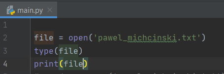
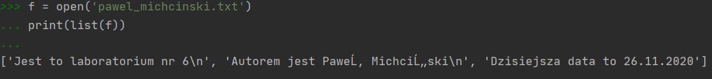

# Praca z plikami
### Navigation List:
* [Operacja 1 - Otwieranie i zamykanie pliku w Pythonie](https://github.com/PawelM98/Uczenie_Maszynowe/tree/master/Lab5#operacja-1---using-spacy) 
* [Operacja 2 - Czytanie i pisanie otwartych plików](https://github.com/PawelM98/Uczenie_Maszynowe/tree/master/Lab5#operacja-2---sentence-detection) 
* [Operacja 3 - Porady i wskazówki](https://github.com/PawelM98/Uczenie_Maszynowe/tree/master/Lab5#operacja-3---tokenization-in-spacy) 

### Poniżej znajduje się opis oraz wyniki działania operacji na plikach za pomocą Pythona.

## Operacja 1 - Otwieranie i  zamykanie pliku w Pythonie
### • Podstawowe funkcje
Otwieranie pliku: 
*.open()* - Funkcja wbudowana, z argumentem, którym jest ścieżka do pliku. 
Zamykanie pliku: 
1. *try-finally* - Funkcja w której po try wykonywane są operacje na pliku, a następnie po finally jest on zamykany.
2. *with* - Po opuszczeniu bloku "with" plik jest automatycznie zamykany nawet w przypadku wystąpienia błędu. 
With open posiada drugi argument "mode" przyjmuje on wartości:
* 'r' - Otwórz do odczytania(domyślne)
* 'w' - Otwórz do zapisu
* 'rb' lub 'wb' - Otwórz w trybie binarnym

### • Typy plików tekstowych
Pliki tekstowe otwierane za pomocą open() zwracają TextIOWrapper obiekt pliku: 
 
 

### • Buforowane typy plików binarnych
Pliki binarne otwierane za pomocą open() zwracają obiekt BufferedReader lub BufferedWriter: 
 

### • Surowe typy plików
Surowy plik jest używany jako element składowy niskiego poziomu dla strumieni binarnych i tekstowych.
Otwieranie takiego pliku wykorzystuje dodatkowy argument buffering i przyjmuje wartość 0. 
Pliki tego typu za pomocą open() zwracają obiekt FileIO pliku: 
 

[NaviList](https://github.com/PawelM98/Uczenie_Maszynowe/tree/master/Lab5#navigation-list) 

## Operacja 2 - Czytanie i pisanie otwartych plików
### • Praktyczne użycie metod '.read(size=-1)', '.readline(size=-1)', '.readlines()' oraz with open
* .read(size=-1) - Odczytuje z pliku na podstawie liczby sizebajtów. Jeśli żaden argument nie jest przekazywana lub Noneczy -1zostanie przyjęta, wtedy cały plik jest odczytywany.
* .readline(size=-1) - Odczytuje maksymalnie sizeliczbę znaków z wiersza. To trwa do końca linii, a następnie zawija się z powrotem. Jeśli żaden argument nie jest przekazywana lub Noneczy -1zostanie przyjęta, wtedy cała linia (lub reszta linii) jest odczytywany.
* .readlines() - To odczytuje pozostałe wiersze z obiektu pliku i zwraca je jako listę.
1. read
     
2. readline
     
3. readlines
    Za pomocą readlines() 
     
    Za pomocą list(): 
     

### • Iterowanie po każdej lini w pliku
Iteracja każdej linii z użyciem readline(): 
 
Iteracja każdej linii z użyciem readlines(): 
 
Iteracja każdej linii po samym obiekcie: 
 

### • Pisanie otwartych plików
Metody dzięki któym możemy pisać po otwartym pliku są następujące: 
1. write(string) - Spowoduje to zapisanie ciągu znaków do pliku. 
2. writelines(seq) - Spowoduje to zapisanie sekwencji do pliku. Żadne zakończenia linii nie są dołączane do każdego elementu sekwencji. To do Ciebie należy dodanie odpowiednich końcówek linii. 
 

### • Praca z bajtami
Ciąg bajtów odczytujemy za pomocą dodania do argumentu mode 'b'.  
 
Otwieranie pliku PNG w Pythonie. Nagłówek pliku PNG jest podzielony na 8 bajtów w następujący sposób:
1. *0x89* - liczba wskazująca że początek to PNG
2. *0x50*, *0x4E*, *0x47* - PNG w ASCII
3. *0x0D*, *0x0A* - Zakończenie linii w stylu DOS \r\n
4. *0x1A* - Znak EOF w stylu DOS
5. *0x0A* - Zakończenie linii w stylu uniksowym \n

Otwarcie pliku PNG  i odczytanie indywidualnych bajtów: 
 

### • Pełny przykład dos2unix.py

[NaviList](https://github.com/PawelM98/Uczenie_Maszynowe/tree/master/Lab5#navigation-list) 

## Operacja 3 - Porady i wskazówki
### • Dołączanie do pliku
Za pomocą znaku 'a' w argumencie 'mode' możemy dopisać dane do istniejącego pliku: 
 

### • Praca z dwoma plikami w tym samym czasie
Jednoczesne odczytywanie i zapisywanie pliku:

### • Tworzenie własnego menedżera kontekstu
Opisac

[NaviList](https://github.com/PawelM98/Uczenie_Maszynowe/tree/master/Lab5#navigation-list) 

