# Praca z danymi w formacie JSON i CSV
Praca na dokumentach JSON podzielona na podrozdziały:
1. Natywne obsługiwanie JSON'a przez Pythona
2. Przykład z prawdziwego świata(w pewnym sensie)
3. Kodowanie i dekodowanie niestandardowych obiektów Pythona

Praca na dokumentach CSV podzielona na podrozdziały:
1. Analiza plików CSV z wbudowaną biblioteką CSV języka Python
2. Przetwarzanie plików CSV za pomocą biblioteki pandas

## Navigation List:
### JSON
* [Funkcja 1 - Trochę słownictwa](https://github.com/PawelM98/Uczenie_Maszynowe/tree/master/Lab8#-troch%C4%99-s%C5%82ownictwa) 
* [Funkcja 2 - Serializacja JSON](https://github.com/PawelM98/Uczenie_Maszynowe/tree/master/Lab8#-serializacja-json) 
* [Funkcja 3 - Prosty przykład serializacji](https://github.com/PawelM98/Uczenie_Maszynowe/tree/master/Lab8#-prosty-przyk%C5%82ad-serializacji) 
* [Funkcja 4 - Kilka przydatnych argumentów słów kluczowych](https://github.com/PawelM98/Uczenie_Maszynowe/tree/master/Lab8#-kilka-przydatnych-argument%C3%B3w-s%C5%82%C3%B3w-kluczowych) 
* [Funkcja 5 - Deserializacja JSON](https://github.com/PawelM98/Uczenie_Maszynowe/tree/master/Lab8#-deserializacja-json) 
* [Funkcja 6 - Prosty przykład deserializacji](https://github.com/PawelM98/Uczenie_Maszynowe/tree/master/Lab8#-prosty-przyk%C5%82ad-deserializacji) 
* [Funkcja 7 - Przykład z prawdziwego świata(w pewnym sensie)](https://github.com/PawelM98/Uczenie_Maszynowe/tree/master/Lab8#przyk%C5%82ad-z-prawdziwego-%C5%9Bwiataw-pewnym-sensie) 
* [Funkcja 8 - Upraszczanie struktur danych](https://github.com/PawelM98/Uczenie_Maszynowe/tree/master/Lab8#-upraszczanie-struktur-danych) 
* [Funkcja 9 - Kodowanie typów niestandardowych](https://github.com/PawelM98/Uczenie_Maszynowe/tree/master/Lab8#-kodowanie-typ%C3%B3w-niestandardowych) 
* [Funkcja 10 - Dekodowanie typów niestandardowych](https://github.com/PawelM98/Uczenie_Maszynowe/tree/master/Lab8#-dekodowanie-typ%C3%B3w-niestandardowych) 

### CSV
* [Funkcja 1 - Czytanie plików CSV za pomocą csv](https://github.com/PawelM98/Uczenie_Maszynowe/tree/master/Lab8#-czytanie-plik%C3%B3w-csv-za-pomoc%C4%85-csv) 
* [Funkcja 2 - Czytanie plików CSV do słownika za pomocą csv](https://github.com/PawelM98/Uczenie_Maszynowe/tree/master/Lab8#-czytanie-plik%C3%B3w-csv-do-s%C5%82ownika-za-pomoc%C4%85-csv) 
* [Funkcja 3 - Opcjonalne parametry czytnika CSV w języku Python](https://github.com/PawelM98/Uczenie_Maszynowe/tree/master/Lab8#-opcjonalne-parametry-czytnika-csv-w-j%C4%99zyku-python) 
* [Funkcja 4 - Pisanie plików CSV za pomocą csv](https://github.com/PawelM98/Uczenie_Maszynowe/tree/master/Lab8#-pisanie-plik%C3%B3w-csv-za-pomoc%C4%85-csv) 
* [Funkcja 5 - Zapisywanie pliku CSV ze słownika za pomocą csv](https://github.com/PawelM98/Uczenie_Maszynowe/tree/master/Lab8#-zapisywanie-pliku-csv-ze-s%C5%82ownika-za-pomoc%C4%85-csv) 
* [Funkcja 6 - Czytanie plików CSV za pomocą pandas](https://github.com/PawelM98/Uczenie_Maszynowe/tree/master/Lab8#-czytanie-plik%C3%B3w-csv-za-pomoc%C4%85-pandas) 
* [Funkcja 7 - Pisanie plików CSV za pomocą pandas](https://github.com/PawelM98/Uczenie_Maszynowe/tree/master/Lab8#-pisanie-plik%C3%B3w-csv-za-pomoc%C4%85-pandas) 

### Poniżej znajduje się opis oraz wyniki działania operacji na plikach za pomocą Pythona.

## JSON - operacje na plikach JSON'owych
### Natywne obsługiwanie JSON'a przez Pythona
#### • Trochę słownictwa
Serializacja - proces kodowania JSON'a inaczej zwana również organizowaniem. 
Deserializacja - wzajemny proces dekodowania danych, któe zostały zapisane lub dostarczone w standardzie JSON. 
[NaviList](https://github.com/PawelM98/Uczenie_Maszynowe/tree/master/Lab8#navigation-list) 

#### • Serializacja JSON
*dump()* - metoda ta zapisuje dane do plików 
*dumps()* - metoda do zapisu w łańcuchu Pythona 
Obiekty Pythona i JSONA odpowiadające sobie: 
**PYTHON**          **JSON** 
dict                object 
list, tuple         array 
str                 string 
int,long,float      number 
True                true 
False               false 
None                null 
[NaviList](https://github.com/PawelM98/Uczenie_Maszynowe/tree/master/Lab8#navigation-list) 

#### • Prosty przykład serializacji
Korzystając z menedżera kontekstu tworzymy plik JSON i otwieramy go w trybie zapisu 
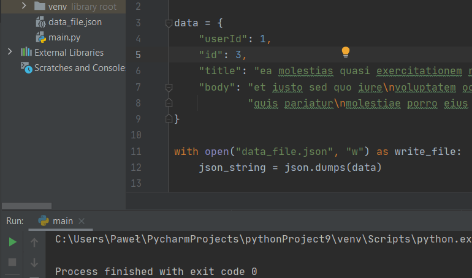 
[NaviList](https://github.com/PawelM98/Uczenie_Maszynowe/tree/master/Lab8#navigation-list) 

#### • Kilka przydatnych argumentów słów kluczowych
Ident - określa rozmiar wcięcia dla zagnieżdżonych struktur. 
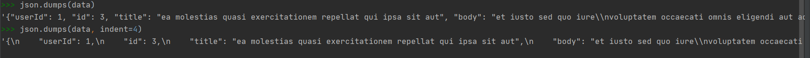 
[NaviList](https://github.com/PawelM98/Uczenie_Maszynowe/tree/master/Lab8#navigation-list) 

#### • Deserializacja JSON
Metody przekształcające pliki JSON'a spowrotem w pliki Pythonowe: 
*load()*  
*loads()*  
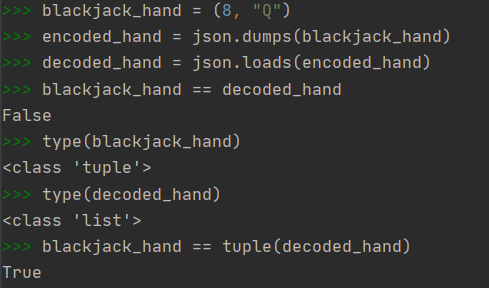 
[NaviList](https://github.com/PawelM98/Uczenie_Maszynowe/tree/master/Lab8#navigation-list) 

#### • Prosty przykład deserializacji
Użycie metod load i loads z otwartym plikiem json: 
 
[NaviList](https://github.com/PawelM98/Uczenie_Maszynowe/tree/master/Lab8#navigation-list) 

### Przykład z prawdziwego świata(w pewnym sensie)
Żądania do interfejsu API JSONPlaceholder 
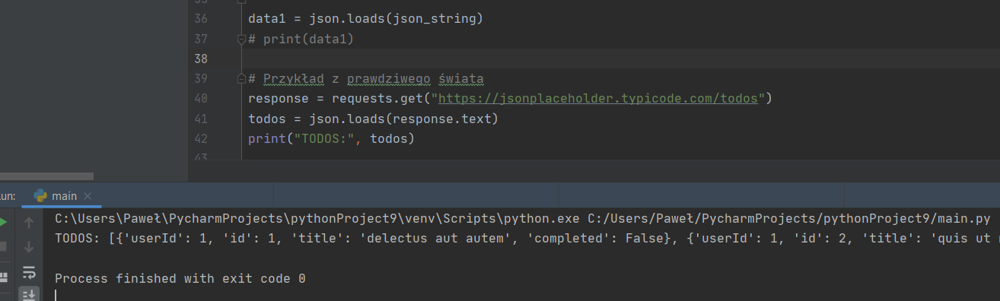 
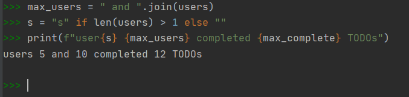 
Sprawdzenie dla użytkowników z różnymi id i zadaniami wykonanymi, którzy z nich wykonali najwięcej 
 
[NaviList](https://github.com/PawelM98/Uczenie_Maszynowe/tree/master/Lab8#navigation-list) 

### Kodowanie i dekodowanie niestandardowych obiektów Pythona
Serializacja klasy - moduł json nie jest w stanie zrobić tego dla klasy Pythonowej 
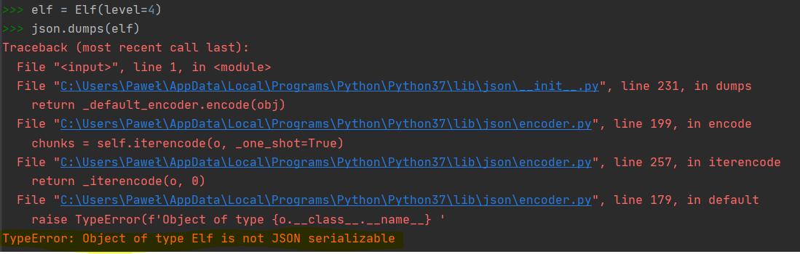 
#### • Upraszczanie struktur danych
Przedstawianie danych w kategoraich wbudowanych typów, które są zrozumiałe przez json'a 
Python ma wbudowany typ klasy o nazwie complex, który reprezentuje liczby zespolone i nie można go serializować. 
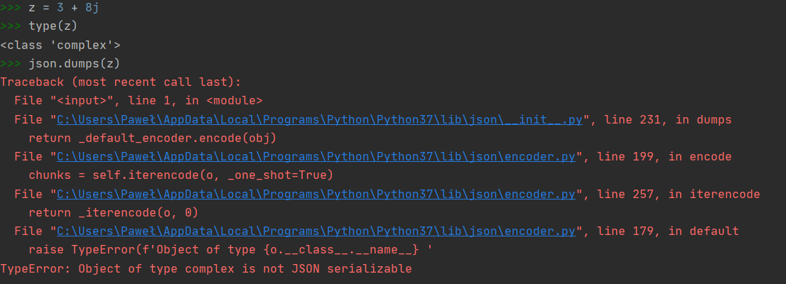 
Minimalna ilość informacji potrzebnych do odtworzenia obiektu w przypadku liczb zespolonych to znajomość częsci rzeczywistej i urojonej. 
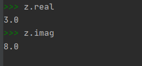 
Przekazanie tych liczb do complex: 
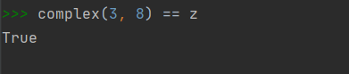 

[NaviList](https://github.com/PawelM98/Uczenie_Maszynowe/tree/master/Lab8#navigation-list) 

#### • Kodowanie typów niestandardowych
Tłumaczenie obiektu niestandardowego na format JSON z pomocą dump() 
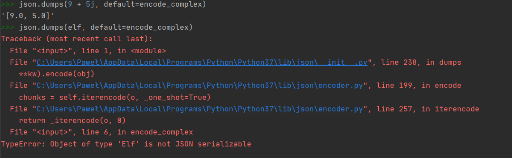 
Użycie metody dump() z parametrem cls=ComplexError 
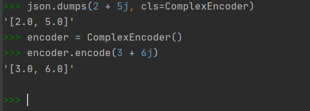 

[NaviList](https://github.com/PawelM98/Uczenie_Maszynowe/tree/master/Lab8#navigation-list) 

#### • Dekodowanie typów niestandardowych
Dekodowanie liczby zespolonej za pomocą ComplexEncoder'a: 
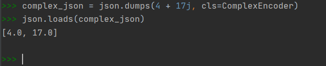 
[NaviList](https://github.com/PawelM98/Uczenie_Maszynowe/tree/master/Lab8#navigation-list) 

## CSV - operacje na plikach CSV
### Analiza plików CSV z wbudowaną biblioteką CSV języka Python
#### • Czytanie plików CSV za pomocą csv
Tekst 
 
[NaviList](https://github.com/PawelM98/Uczenie_Maszynowe/tree/master/Lab8#navigation-list) 

#### • Czytanie plików CSV do słownika za pomocą csv
Tekst 
 
[NaviList](https://github.com/PawelM98/Uczenie_Maszynowe/tree/master/Lab8#navigation-list) 

#### • Opcjonalne parametry czytnika CSV w języku Python
Tekst 
 
[NaviList](https://github.com/PawelM98/Uczenie_Maszynowe/tree/master/Lab8#navigation-list) 

#### • Pisanie plików CSV za pomocą csv
Tekst 
 
[NaviList](https://github.com/PawelM98/Uczenie_Maszynowe/tree/master/Lab8#navigation-list) 

#### • Zapisywanie pliku CSV ze słownika za pomocą csv
Tekst 
 
[NaviList](https://github.com/PawelM98/Uczenie_Maszynowe/tree/master/Lab8#navigation-list) 

### Przetwarzanie plików CSV za pomocą biblioteki pandas
#### • Czytanie plików CSV za pomocą pandas
Tekst 
 
[NaviList](https://github.com/PawelM98/Uczenie_Maszynowe/tree/master/Lab8#navigation-list) 

#### • Pisanie plików CSV za pomocą pandas
Tekst 
 
[NaviList](https://github.com/PawelM98/Uczenie_Maszynowe/tree/master/Lab8#navigation-list) 

