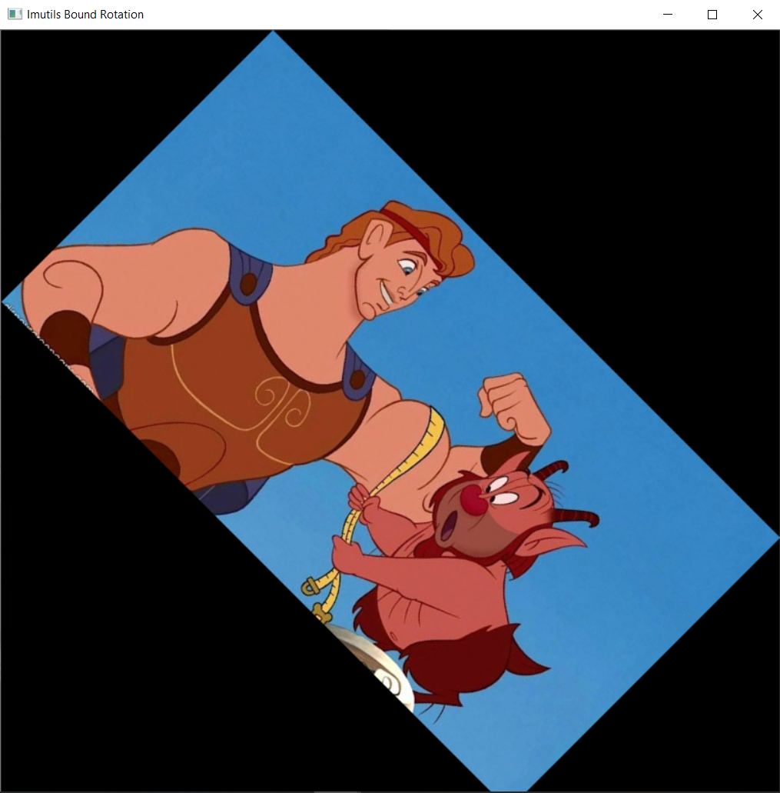

# Obrazek - Herkules

### Działanie na obrazku herkules. Użytych zostało 14 funkcji

## Funkcja 1
* Ładowanie i wyświetlanie obrazu
Załadowanie obrazu metodą 'imread'. Za pomocą ".shape" wydobywamy: wysokość, szerokość oraz głębokość obrazu, który jest tablicą z pakietu numpy.
Za pomocą metody "cv2.imshow" wyświetlamy obraz oraz nadajemy mu nazwe w okienku. Komenda cv2.waitKey zapobiega zniknięciu obrazka tuż po wyświetleniu.
<!---->

## Funkcja 2
* Otrzymywanie indywidualnych pixeli
Wyświetlenie pixela RGB z lokalizacją x=50, y=100.

## Funkcja 3
* Przycinanie obrazka
ROI wycinanie obszaru zainteresowania z obrazka

## Funkcja 4
* Zmiana rozmiaru obrazka
Zmiana rozmiaru obrazka z 747x400 na 200x200 bez uwzględnienia aspect ratio.

## Funkcja 5
* Zmiana rozmiaru obrazka
Uwzględnienie aspect ratio

## Funkcja 6
* Zmiana rozmiaru obrazka
Użycie biblioteki "imutlis". Metoda "resize" pozwala na zmiane rozmiaru, poprzez podanie wysokości lub szerokości obrazka.

## Funkcja 7
* Obracanie obrazka
Obracamy względem centrum oraz według wskazówek zegara o 45 stopni.
Początkowo wyznaczamy centrum, a później wyliczamy obróconą matrycę.

## Funkcja 8
* Obracanie obrazka
Obrócenie obrazka podobnie jak w funkcji 7, lecz z użyciem 'imutlis.rotate'.

## Funkcja 9
* Obracanie obrazka
Eliminacja ucięcia obrazka podczas obracania z użyciem metody "rotata_bound".

## Funkcja 10
* Rozmazanie obrazka
Użycie metody "GaussianBlur". Rozmazanie ma na celu redukcję "frequency noise" aby ułatwić pracę algorytmom.
Użyte parametry kernel 11x11. Im większe, tym bardziej większe rozmazanie obrazu i analogicznie z mniejszym rozmazaniem.

## Funkcja 11
* Rysowanie na obrazku
Metoda "rectangle" w kolejności parametry: 1 obrazek na którym rysujemy, 2 startujący pixel, 3 pixel końcowy, 4 grubość linii.
Jako punkt rysowania został obrany biceps herkulesa.

## Funkcja 12
* Rysowanie na obrazku
Metoda "circle": 1 obrazek na którym rysujemy, 2 usytuowanie okręgu, 3 radiacja okręgu, 4 kolor, 5 grubość linii.
Zmiana nosa Phila z czerwonego na niebieski.

## Funkcja 13
* Rysowanie na obrazku
Metoda "line" jest bardzo podobna do metody "rectangle". Rysowana jest linia prosta od pixela start do pixela końcowego.
Narysowanie lini na ręce herkulesa.

## Funkcja 14
* Rysowanie na obrazku
Metoda putText pozwala na nałożenie tekstu na obrazek.
Parametry "putText": 
1. Obrazek na którym rysujemy
2. Ciąg znaków który chcemy wypisać
3. Punkt początkowy tekstu
4. Styl czcionki
5. Rozmiar czcionki
6. Kolor
7. Grubość pociągniecia przez pixele

# Obrazek - Bloki

### Działanie na obrazku bloczki, użyto 9 funkcji.

## Funkcja 1
* Załadowanie obrazka z lini komend.

## Funkcja 2
* Konwertowanie obrazka na szary kolor
Metoda "cvtColor" przyjmuje obraz do zmiany w pierwzym argumencie, a w drugim zmiana koloru przez flagę "COLOR_BGR2GRAY".

## Funkcja 3
* Wykrywanie krańców
Algorytm "Canny" jest w stanie wykryć progi w danym obrazku, przyjmuje w kolejności parametry:
1. obrazek do operacji
2. minimalny próg
3. maksymalny próg

## Funkcja 4
* Progowanie
Metoda threshold pozwala na zlikwidowanie jaśniejszych lub ciemniejszych regionów konturów obrazków.
Parametry w kolejności:
1. Obrazek zmieniony na gray 
2. Wyłapanie wszystkich pixeli poniżej 225 i ustawienie ich na 255 (biay kolor) Pierwszy plan

## Funkcja 5
* Wykrywanie i rysowanie konturów
Metoda "findContours" - użycie trhesh.copy z wykrytych progów w obrazku na pierwszym planie.
Metoda "drawContours" - drukowanie każdego elementu c z cnts czyli contours. Tuple (240, 0, 159) oznacza kolor fioletowy konturów. 3 grubość linii.

## Funkcja 6
* Zliczanie wykrytych konturów oraz rysowanie ich
Użycie funkcji len do zliczneia długości tablicy konturów

## Funkcja 7
* Erozja i Dylatacja
Erozje są używane by zredukować rozmiar obiektów na pierwszym planie. Kontury są zmniejszane przez interacje w tym wypadku 5.

## Funkcja 8
* Dylatacja działa w sposób odwrotny do erozji

## Funkcja 9
* Operacje maskowe i bitowe

